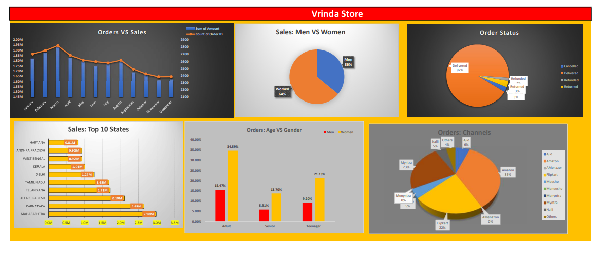

# Vrinda Store Data Analysis

This repository contains an end‑to‑end analysis of Vrinda Store sales and customer data. The objective is to uncover trends, key performance indicators (KPIs), and actionable insights to support data‑driven decisions.

## Project Files
- `Vrinda Store Data Analysis Report.xlsx`: Interactive Excel report with analysis, KPIs, and visuals.
- `Vrinda Store Data Analysis.pdf`: Static export of the report for easy viewing.
- `images/dashboard.png`: Snapshot of the dashboard used in the report.

## Dashboard Snapshot



## Key Questions Answered
- What are the overall sales and order trends over time?
- Which product categories and sub‑categories drive the most revenue?
- Who are our top customer segments and regions?
- What are the best‑performing channels and periods?
- How do returns/refunds affect net performance?

## High‑Level Insights
- Seasonal patterns indicate peak demand during select months, suggesting opportunities for targeted campaigns and inventory planning.
- A small set of categories contributes a disproportionate share of revenue (Pareto effect), highlighting cross‑sell and upsell opportunities.
- Certain regions and channels outperform, indicating where to prioritize marketing spend.
- Repeat customers significantly impact revenue; loyalty initiatives could improve retention and lifetime value.

## Methodology
- Data source: Vrinda Store sales and customer records (Excel workbook).
- Tools: Microsoft Excel (Power Query, Pivot Tables, Charts), basic data cleaning, aggregation, and time‑series trend analysis.
- Approach: Data cleaning → Feature derivation (e.g., month, category, channel) → Exploratory analysis → KPI design → Visualization.

## KPIs Tracked
- Total Revenue, Total Orders, Average Order Value (AOV)
- Category/Channel contribution to revenue and orders
- Monthly growth rate, YoY/seasonal trend signals
- Customer segmentation metrics (new vs. repeat)

## How to Use
1. Open `Vrinda Store Data Analysis Report.xlsx` to explore the interactive pivot tables and charts.
2. Refer to `Vrinda Store Data Analysis.pdf` for a quick read‑only summary.
3. Use `images/dashboard.png` in presentations or documentation.

## Reproducibility
- The analysis is self‑contained in the Excel workbook. No external dependencies are required.
- If data is updated, refresh Pivot Tables/Charts to recompute KPIs.

## Repository Structure
```
Vrinda store analysis/
├─ images/
│  └─ dashboard.png
├─ Vrinda Store Data Analysis Report.xlsx
├─ Vrinda Store Data Analysis.pdf
└─ README.md
```

## License
This repository is shared for educational and portfolio purposes. For commercial use or redistribution, please contact the author.
